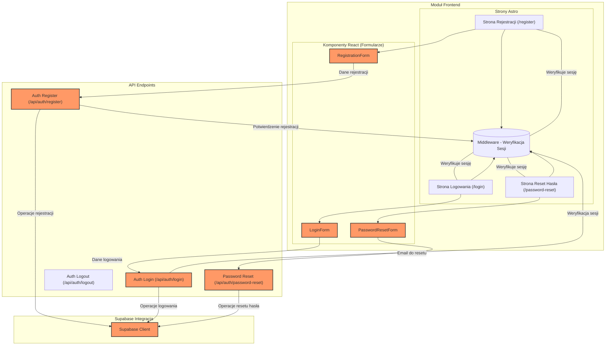

<architecture_analysis>
1. Komponenty wymienione w dokumentach:
   - Strony Astro: Strona Rejestracji (/register), Strona Logowania (/login), Strona Reset Hasła (/password-reset).
   - Layouty: Wspólny layout z logiką ukrywania elementów (dla niezalogowanych) oraz widoczne elementy dla zalogowanych użytkowników.
   - Komponenty React: RegistrationForm, LoginForm, PasswordResetForm - komponenty obsługujące interaktywne formularze.
   - Backend API: Endpointy /api/auth/register, /api/auth/login, /api/auth/logout, /api/auth/password-reset.
   - Supabase Client: Klient znajdujący się w src/db/supabase.client.ts wykorzystywany do operacji autentykacyjnych.
   - Middleware: Mechanizm weryfikacji sesji przed renderowaniem stron chronionych.

2. Główne strony i odpowiadające im komponenty:
   - /register: Strona Astro zawierająca RegistrationForm.
   - /login: Strona Astro zawierająca LoginForm.
   - /password-reset: Strona Astro zawierająca PasswordResetForm.

3. Przepływ danych między komponentami:
   - Użytkownik wprowadza dane w formularzach (RegistrationForm, LoginForm, PasswordResetForm) -> komponenty React wykonują walidację i wysyłają dane do odpowiednich backend endpointów.
   - Endpointy API przetwarzają żądania, komunikują się z Supabase Client, a wyniki (sukces/błąd) przekazywane są do komponentów.
   - Middleware w Astro przed renderowaniem stron chronionych weryfikuje stan sesji.

4. Opis funkcjonalności:
   - RegistrationForm: Walidacja danych rejestracyjnych i wysyłka do /api/auth/register.
   - LoginForm: Walidacja danych logowania i wysyłka do /api/auth/login.
   - PasswordResetForm: Walidacja adresu email i inicjacja procedury resetu hasła poprzez /api/auth/password-reset.
   - Middleware: Sprawdza stan sesji użytkownika przed renderowaniem stron.
   - API Endpoints: Obsługa operacji rejestracji, logowania, wylogowywania i resetowania hasła.
   - Supabase Client: Komunikacja z usługą Supabase Auth.
</architecture_analysis>

<mermaid_diagram>

</mermaid_diagram> 